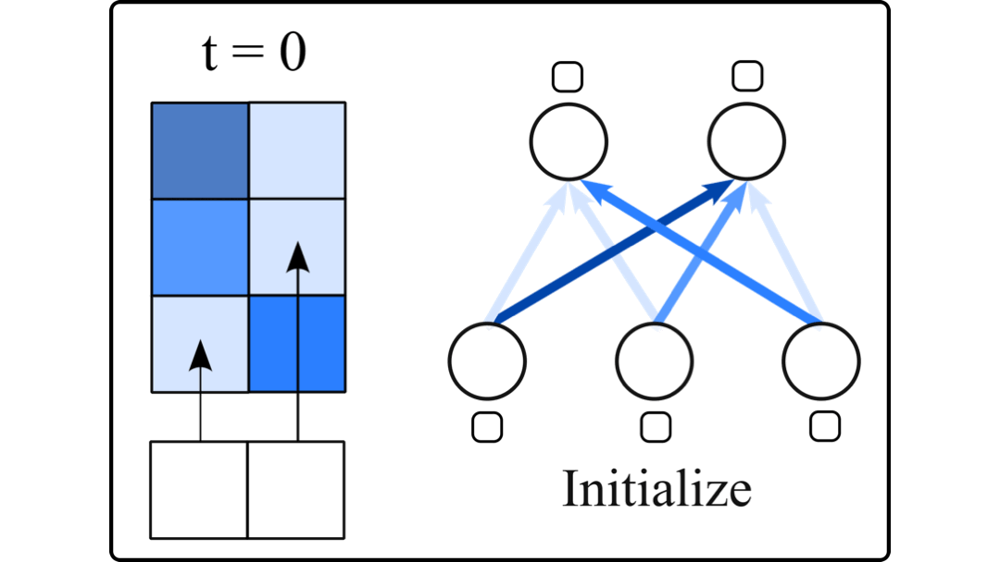

# Scaling Sparse Fine-Tuning to Large Language Models

This is the code to replicate the instruction tuning experiments in the paper [*Scaling Sparse Fine-Tuning to Large Language Models*](https://arxiv.org/abs/2401.16405). [[cite]](#citation)

For our Sparse Fine-Tuning (SFT) implementation based on the Hugging Face library, please visit [peft](https://github.com/AlanAnsell/peft).

**Important**: This requires [our PEFT implementation](https://github.com/AlanAnsell/peft) and will **not** work with HuggingFace PEFT!



## Setup
First, install the Python libraries and initialise the [peft](https://github.com/AlanAnsell/peft) submodule.

You can set `SFT_EXPERIMENT_DIR` to your preferred path for storing models and results.

```bash
pip install -r requirements.txt
git submodule update --init --recursive
cd peft
python setup.py develop
export SFT_EXPERIMENT_DIR=./results
```

Next, prepare train and eval data. 

Note that our original experiments were run based on the [Flan v2 50K sub-mixture](https://beaker.org/api/v3/datasets/01HBS0N5ZSDF5AECA9VMB1RKXQ/files/flan_v2_resampled_50k.jsonl) stored on Beaker, which now requires authorisation for access. Hence, we now rely on an unofficial snapshot from the Hugging Face Hub.

```bash
./scripts/prepare_train_data.sh
./scripts/prepare_eval_data.sh
```

## Train

To fine-tune an LLM with PEFT, run the following command.

You can specify your preferred LLM, PEFT method, quantization, and hyper-parameters inside the script file.

```bash
./scripts/finetune_peft_with_accelerate.sh
```

## Eval

Finally, you can run evaluation on all benchmarks (MMLU, BBH-Hard, GSM, TyDiQA, Codex-HumanEval) with the following script. Remember to specify the path to the trained PEFT parameters as `PEFT` and set the desired quantisation inside the script.

```bash
./scripts/eval_all.sh
```

## Acknowledgements
Our code and setup for the instruction tuning experiments builds on [open-instruct](https://github.com/allenai/open-instruct).

## Citation
Please use the following snippet to cite our work.

```bibtex
@misc{ansell2024scaling,
      title={Scaling Sparse Fine-Tuning to Large Language Models}, 
      author={Alan Ansell and Ivan Vulić and Hannah Sterz and Anna Korhonen and Edoardo M. Ponti},
      year={2024},
      eprint={2401.16405},
      archivePrefix={arXiv},
      primaryClass={cs.CL}
}
```